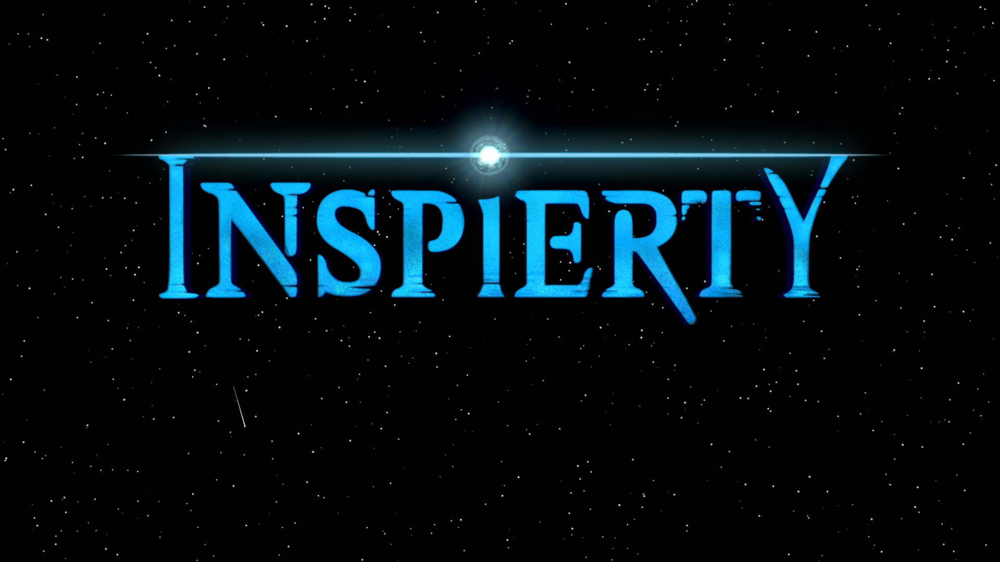

# Inspierty Constellation Trailer Visualization

Visualization of the trailer soundtrack from the album constellation of the band [Inspierty](https://inspierty.de/).

[See it in action](https://enc-ee.github.io/inspierty-constellation-trailer-visualization/dist/)



## Parameters
You can specify some parameters to adjust sensitivity and appearance.
Add ?spec&fps=30 to the url to see a spectrum and have a frame rate of 30 fps.

- `nos=x` -> number of stars
- `spec` -> draw a spectrum
- `mic` -> use the microphone input for visualization instead of the album trailer
- `fi=x` -> uses the xth frequency of the spectrum for analysis
- `rel` -> show relative data value which is used for analysis
- `lb=x` -> specify the lower border at which the frequency should be evaluated (0..1)
- `ub=x` -> specify the upper border which will be evaluated as a maximum (0..1)

# Get Started

1. Clone the Rpository
```
git clone https://github.com/Enc-EE/inspierty-constellation-trailer-visualization.git
```
2. Change the directory
```
cd inspierty-constellation-trailer-visualization
```
3. Install dependencies
```
npm install
```
4. Start webpack server
```
npm start
```
5. Open [http://localhost:8080/](http://localhost:8080/)